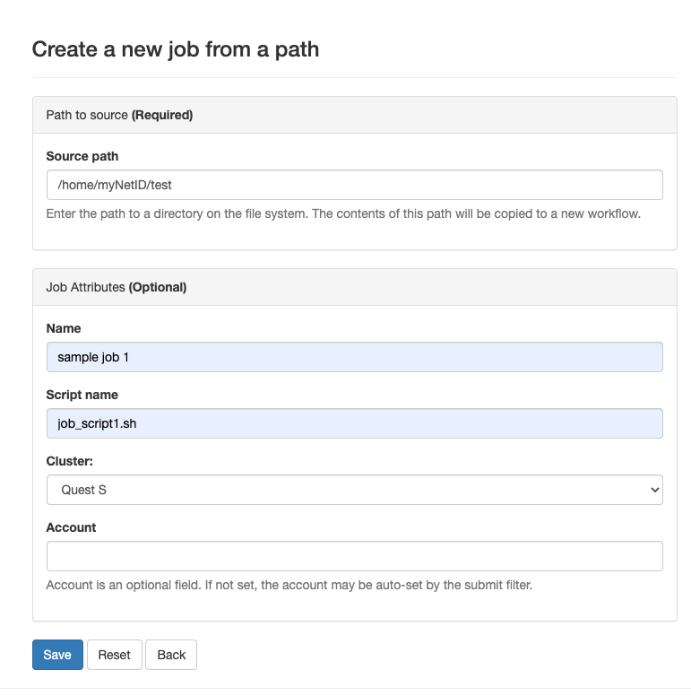
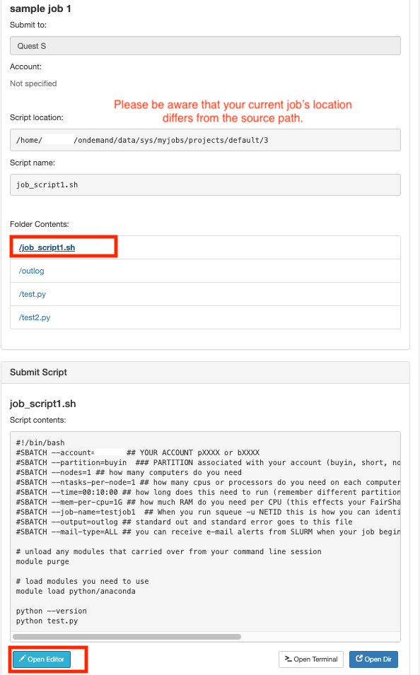
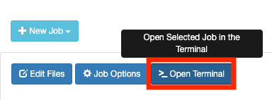
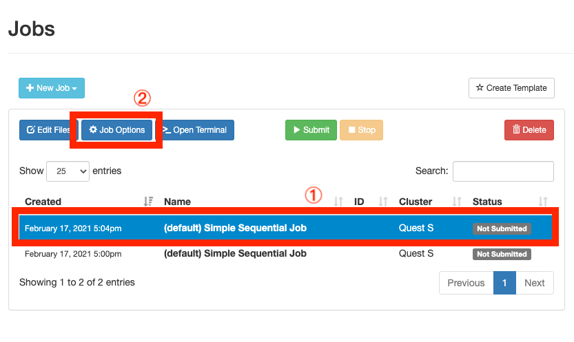
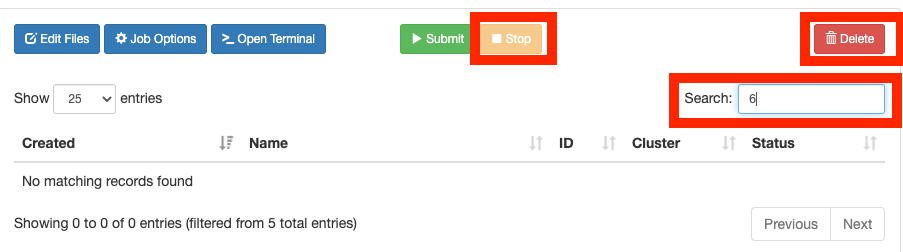
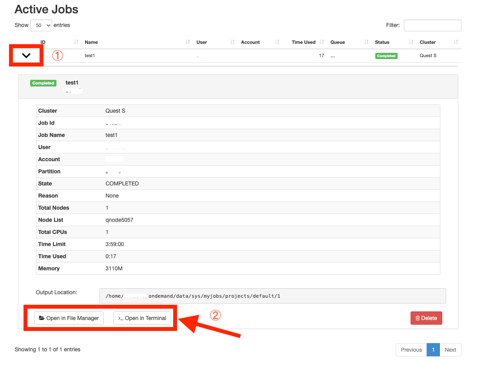

# [OnDemand](https://qondemand.ci.northwestern.edu/)

## Table of Contents

- [OnDemand](#ondemand)
  - [Table of Contents](#table-of-contents)
  - [Overview <a name = "overview"></a>](#overview-)
  - [Accessing OnDemand  <a name = "accessing_ondemand"></a>](#accessing-ondemand--)
    - [Browser Requirements](#browser-requirements)
  - [File Management  <a name = "file_management"></a>](#file-management--)
  - [Job Management <a name = "job_management"></a>](#job-management-)
    - [Steps for creating a new Quest job](#steps-for-creating-a-new-quest-job)
    - [Creating templates for job submissions](#creating-templates-for-job-submissions)
    - [Monitoring existing jobs](#monitoring-existing-jobs)
  - [Accessing Command-line Shell <a name = "accessing_shell"></a>](#accessing-command-line-shell-)
  - [requirements for extension](#requirements-for-extension)
  - [3. VirtualGL 2.5+ only necessary to enable GPU acceleration](#3-virtualgl-25-only-necessary-to-enable-gpu-acceleration)
  
## Overview <a name = "overview"></a>

[OnDemand](https://qondemand.ci.northwestern.edu/) provides web access for the university's high performance computing(HPC) systems [QUEST](https://www.it.northwestern.edu/research/user-services/quest/index.html). By opening a web browser, OnDemand users have the opportunity to:

- Manage files on Quest: upload, download, view, edit files and folders
- Compose and monitor jobs on Quest: create, edit, submit jobs with templates and script editors
- Access command-line shell

---

## Accessing OnDemand  <a name = "accessing_ondemand"></a>
Please make sure you have a valid Quest account, otherwise, computational time on the Quest cluster can be requested [here](https://www.it.northwestern.edu/secure/forms/research/allocation-request.html).
To connect to OnDemand, open a browser and visit https://qondemand.ci.northwestern.edu/. For unmanaged university computers or home computers, please make sure you are connected to a [Northwestern VPN](https://www.it.northwestern.edu/offcampus/). A popup window would ask for your username and password.\
**Hostname** : qondemand.ci.northwestern.edu\
**Username** : your Northwestern NetID (all lowercase letters)\
**Password** : your Northwestern NetID password


### Browser Requirements

Google Chrome, Mozilla Firefox, or Microsoft Edge. Please note that IE11 is not supported. 

Also, please make sure that your browser's pop-up blocker isn't preventing the sign-in window from being displayed. To configure the pop-up settings in your browser, please visit [this page](https://kb.northwestern.edu/page.php?id=77182).


---

## File Management  <a name = "file_management"></a>

Once you've logged into OnDemand, by clicking "Files" &#8594; "Home Directory" in the main menu, you will be directed to the file explorer page. By default, you will be viewing your home directory on Quest: ```/home/<NetID>```. The home directory has 80GB of storage and is backed up nightly. Backups are kept for two weeks.


**Navigating**

The file explorer provides many options to go to your files and file management. You can navigate the folders similarly to a desktop GUI. Your **current directory** is located the near top of the browsing window.


**Switching folders:**

- Double-click the folder name in the main section
- Single-click the folder name in the left tree view
- Click the button named "GO TO..." and enter your folder directory


**Backtracking the path:**

- Single-click the filename marked as blue in your current directory
- Double-click the ".." which is the first entry on top of your files in the main section


**Uploading files**

Go to your destination folder, and then

- Drag files from your local file navigator to your OnDemand browser window
- Click the "Upload" button located on the top-right corner of your browser and click the "Choose Files" button to choose files on your local computer


**Downloading files**

- Click the file or multi-select with "control+click" the files first. Then click the "Download" button. Please note that if a folder is selected, it will be automatically zipped when downloading.


**Viewing or Editing files**

- OnDemand offers built-in file editors with syntax highlight which will automatically be opened in a new tab of your browser. To view or edit a file, select the file name you would like to view or edit, then click the "View" or "Edit" button to direct to the new tab.


- Then Single-click the refreshing icon located on the left of the current directory to let new changes appearing on the screen


**Changing viewing options**

- To show all dotfiles such as *.bash_profile*, please select the checkbox named "Show Dotfiles" on the upper-right corner of the webpage.

- To view file owner or mode, please select the checkbox named "Show Owner/Mode" on the upper-right corner of the webpage.


--- 

## Job Management <a name = "job_management"></a>

OnDemand provides a graphical user interface so that you can create new Quest jobs as well as manage and view existing jobs all in one browser. To navigate to the job management page, please select "Jobs" in the dashboard's main menu, and choose either "Active Jobs" to view existing jobs or "Job Composer" to create a new job.

\
The following window will appear in a new tab of your browser.\


### Steps for creating a new Quest job

1. **Create a new job** by copying from an existing job template directory or a previously run job directory.
   - Create: Begin by creating a new job from an existing template, from any arbitrary path on the file system, or by copying a job you have already created through the Job Composer.
  

    - <ins>Option 1: from specified path (recommended)<ins>
      - all your files under the source path will be copied to "/home/netID/ondemand/data/sys/myjobs/projects/default/#" for submission.
      - Please make sure that there is a valid submission script (.sh) in your source path folder
      
      - to edit the submission script "main_job.sh", please either click the "/main_job.sh" under "folder contents", or click "Open Editor". A new editor window will be opened in the new tab of your browser.
      - [click here for more sample submission scripts](https://github.com/nuitrcs/examplejobs)
      

     - Option 2: from default template
       - the script location of default job is "/home/netID/ondemand/data/sys/myjobs/projects/default/#". A new folder will be automatically created with script name of "main_job.sh"
        
       - for more info to create a customized template, please see the "Creating templates for job submissions" session below.
  


    - Option 3: from selected job
      - This will create an unsubmitted copy of your current selecting job so you can easily make multiple submissions of the same script.
     <!--  -->


2. **Edit the files in the job** via the file explorer.
   - Edit: Select a job and click here to open the path in the file explorer so you can edit the job's files.
      
   - Select an existing job and click here to open a new terminal starting in the job's path.
      

3. **Optional** 
    - to change the job name, specify job script, account, job array, please first select the job, then click the "Job Options" button.
    - [Examples of Different Types of Jobs on Quest](https://kb.northwestern.edu/page.php?id=70719)
    
   
4. **Submit the job** 
   - Submit: Select an existing job and click here to submit the job to the batch queue.
    
   - [Error message page](https://kb.northwestern.edu/page.php?id=91392)

5. **For existing jobs**
   - You can also stop, delete, or filter existing jobs.
  


### Creating templates for job submissions


- You can also create new job templates from existing jobs. This way, you can use that job as a template for future jobs. Select the job in the table to copy, then click "Create Template" to initiate the template creation process.
  - [Example submission script with commands and options here](https://kb.northwestern.edu/page.php?id=69247)


### Monitoring existing jobs


The "Active Jobs" page lists all of your jobs currently in a queue no matter how they were submitted, and jobs that are recently completed within a short time frame. You can see job info like ID, Name, User, Account, Time Used, Queue, Status, Cluster, and filter jobs on this page. 


**Checking Job Output or Running Details**
- go to the "Active Jobs" page from the dashboard.
  
- Click the expansion button to show details of your selected jobs.
  

- [Find out the meaning of each job state here](https://kb.northwestern.edu/page.php?id=70711)

--- 

## Accessing Command-line Shell <a name = "accessing_shell"></a>

Without opening a terminal window, you can open the Quest S shell via OnDemand, which is equivalent to [connecting with an SSH terminal](https://kb.northwestern.edu/quest-login) with the following ways.

- Navigate to "Clusters"  &#8594; "_Quest S Shell Access" on the main menu in the dashboard. Please note that on the terminal page, your default working location would be your home folder. 


- Under the Job Composer page (qondemand.ci.northwestern.edu/pun/sys/myjobs), click the "Open Terminal" button. Please note that on the terminal page, your default working location would be your job script location.


- Under the File Explorer page (qondemand.ci.northwestern.edu/pun/sys/files/fs/home/NetID/), click the "Open in Terminal" button. Please note that on the terminal page, your default working location would be whatever is your current viewing directory on the OnDemand file explorer.


  - To print your current working directory in shell, please type ```pwd```.
  - [Command line introduction](https://workshops.rcs.northwestern.edu/workshop/command_line/)
  - [Quest Quick Start](https://kb.northwestern.edu/quest-quickstart)
  - [Commonly used commands](https://kb.northwestern.edu/page.php?id=70710)

---
## requirements for extension
###[Interactive Apps](https://osc.github.io/ood-documentation/latest/app-development/interactive/setup.html) 
Including Deskptop App, Jupyter Notebook server, RStudio server, COMSOL server, etc
- VNC server on the compute node
  1. nmap-ncat
  2. TurboVNC 2.1+
  3. websockify 0.8.0+
- Modify cluster config /etc/ood/config/clusters.d/my_cluster.yml
- Reverse proxy

###[Interactive Desktop](https://osc.github.io/ood-documentation/latest/enable-desktops.html)
Including launching a Gnome 2, Mate, or Xfce desktop 
- Requires a Desktop Environment be installed on the nodes that the batch job is meant to run on
  1. Xfce Desktop 4+
  2. Mate Desktop 1+ (default)
  3. Gnome Desktop 2 (currently we do not support Gnome 3)
- Configure working directory /etc/ood/config/apps/bc_desktop (form.yml, my_cluster.yml, owens_login_desktop.yml, my_submit.yml.erb)
  1. Configure the submission parameters for cluster’s resource manager.
  2. Configure User Form 
  3. Configure LinuxHost Adapter
  4. Config job submission 

###[Jupyter Notebook](https://osc.github.io/ood-documentation/latest/app-development/tutorials-interactive-apps/add-jupyter.html)
- software requirements
  1. Jupyter Notebook 4.2.3+ (earlier versions are untested but may work for you)
  1. OpenSSL 1.0.1+ (used to hash the Jupyter Notebook server password)
- Configure sandbox directory "${HOME}/ondemand/dev"
  1. Navigate to https://ondemand.my_center.edu/, link to git, clone the app
  2. Configure user forms (form.yml)
  3. Configure job-submit parameters (submit.yml.erb)
- Deploy by copying the app to the system deployment location as root

###[RStudio](https://osc.github.io/ood-documentation/latest/app-development/tutorials-interactive-apps/add-rstudio.html)
- similar to above but with different software requirements and additional Singularity config
  1. R
  2. RStudio
  3. Singularity (2.x or 3.x)


###[Matlab](https://osc.github.io/ood-documentation/latest/app-development/tutorials-interactive-apps/add-matlab.html)
- similar to above but with different software requirements and additional Launch Script and window manager configuration
  1. Xfce Desktop 4+ or Mate Desktop 1+ (provides window manager, terminal, file manager)
  2. OpenJDK runtime
  3. VirtualGL 2.5+ only necessary to enable GPU acceleration
---
**References & cites that are related**

official docs:
https://openondemand.org/
https://github.com/OSC/openondemand.org

formatting:
https://kb.northwestern.edu/page.php?id=70716

ondemand tutorial: 
https://www.osc.edu/resources/online_portals/ondemand
https://research.computing.yale.edu/training/hpc-series/introduction-open-ondemand-ood
https://ubccr.freshdesk.com/support/solutions/articles/13000039875-ccr-ondemand-portal
https://www.chpc.utah.edu/documentation/software/ondemand.php

other hpc page mentioning ondemand:
https://sites.google.com/view/cluster-user-guide/home
https://it.tufts.edu/high-performance-computing


