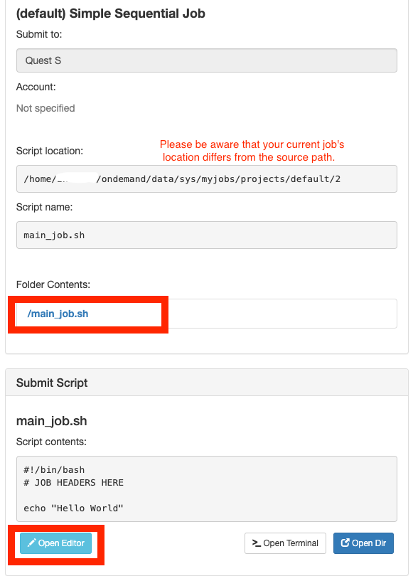
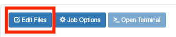
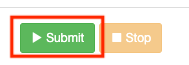

# OnDemand

## Table of Contents

- [OnDemand](#ondemand)
  - [Table of Contents](#table-of-contents)
  - [Overview <a name = "overview"></a>](#overview-)
  - [Accessing OnDemand  <a name = "accessing_ondemand"></a>](#accessing-ondemand--)
    - [Browser Requirements](#browser-requirements)
  - [File Management  <a name = "file_management"></a>](#file-management--)
  - [Job Management <a name = "job_management"></a>](#job-management-)
    - [Steps for creating a new Quest job](#steps-for-creating-a-new-quest-job)
    - [Creating templates for job submissions](#creating-templates-for-job-submissions)
    - [Monitoring existing jobs](#monitoring-existing-jobs)
  - [Accessing Command-line Shell <a name = "accessing_shell"></a>](#accessing-command-line-shell-)
  - [TODO:](#todo)
  - [References](#references)
  
## Overview <a name = "overview"></a>

[OnDemand](https://qondemand.ci.northwestern.edu/) provides web access for the university's high performance computing(HPC) systems [QUEST](https://www.it.northwestern.edu/research/user-services/quest/index.html). By opening a web browser, OnDemand users have the oppotunity to:

- Manage files on Quest: upload, download, view, edit files and folders
- Compose and monitor jobs on Quest: create, edit, submit jobs with templates and script editors
- Access command-line shell

---

## Accessing OnDemand  <a name = "accessing_ondemand"></a>
Please make sure you have a valid Quest account, otherwise, computational time on the Quest cluster can be requested [here](https://www.it.northwestern.edu/secure/forms/research/allocation-request.html).
To connect to OnDemand, open a browser and visit https://qondemand.ci.northwestern.edu/. For unmanaged university computers or home computers, please make sure you are connected to a [Northwestern VPN](https://www.it.northwestern.edu/offcampus/). A popup window would ask for your username and password.\
**Hostname** : qondemand.ci.northwestern.edu\
**Username** : your Northwestern NetID (all lowercase letters)\
**Password** : your Northwestern NetID password


### Browser Requirements

Google Chrome, Mozilla Firefox or Microsoft Edge. Please note that IE11 is not supported. 

Also, please make sure that your browser's pop-up blocker isn't preventing the sign in window from being displayed. To configure the pop-up settings in your browser, please visit [this page](https://kb.northwestern.edu/page.php?id=77182).


---

## File Management  <a name = "file_management"></a>

Once you've logged into OnDemand, by clicking "Files" &#8594; "Home Directory" in the main menu, you will be directed to the file explorer page. By default, you will be viewing your home directory on Quest: ```/home/<NetID>```. The home directory has 80GB of storage and is backed up nightly. Backups are kept for two weeks.


**Navigating**

The file explorer provides many options to go to your files and file management. You can navigate the folders similarly to a desktop GUI. Your **current directory** is located on the near top of the browsing window.


**Switching folders:**

- Double click the folder name in the main section
- Single click the folder name in the left tree view
- Click the button named "GO TO..." and enter your folder directory


**Backtracting the path:**

- Single click the filename marked as blue in your current directory
- Double click the ".." which is the first entry on top of your files in the main section


**Uploading files**

Go to your destination folder, and then

- Drag files from your local file navigator to your OnDemand browser window
- Click "Upload" button located on the top-right corner of your browser and click "Choose Files" button to choose files in your local computer


**Downloading files**

- Click the file or multiselect with "control+click" the files first. Then click the "Download" button. Please note that if a folder is selected, it will be automatically zipped when downloading.


**Viewing or Editing files**

- OnDemand offers built-in file editors with syntax highlight which will automatically be opened in a new tab of your browser. To view or edit a file, select the file name you would like to view or edit, then click the "View" or "Edit" button to direct to the new tab.


- Then single click the refreshing icon located on the left of current directory to let new changes appearing on the screen


**Changing viewing options**

- To show all dotfiles such as *.bash_profile*, please select the checkbox named "Show Dotfiles" on the upper-right corner of the webpage.

- To view file owner or mode, please select the checkbox named "Show Owner/Mode" on the upper-right corner of the webpage.


--- 

## Job Management <a name = "job_management"></a>

OnDemand provides graphical user interface so that you can create new Quest jobs as well as manage and view existing jobs all in one browser. To navigate to job management page, please select "Jobs" in dashboard's main menu, and choose either "Active Jobs" to view existing jobs or "Job Composer" to create a new job.
\
The following window will appear in a new tab of your browser.\


### Steps for creating a new Quest job

1. **Create a new job** by copying from an existing job template directory or a previously run job directory.
   - Create: Begin by creating a new job from an existing template, from any arbitrary path on the file system, or by copying a job you have already created through the Job Composer. Please be aware of your current working directory of this new job. 
  

     - Option 1: from default template
       - the script location of default job is "/home/netID/ondemand/data/sys/myjobs/projects/default/#". A new folder will be automatically created with script name of "main_job.sh"
         - to edit the submission script "main_job.sh", please either click the "/main_job.sh" under "folder contents", or click "Open Editor". A new editor window will be opened in the new tab of your browser.
       
       - for more info to create a customized template, please see the "Creating templates for job submissions" session below.
  
    - Option 2: from specified Path
      - all your files under the source path will be copied to "/home/netID/ondemand/data/sys/myjobs/projects/default/#" for submission.
     

    - Option 3: from selected job
      - This will create an unsubmitted copy of your current selecting job so you can easily make multiple submissions.
     <!--  -->


2. **Edit the files in the job** via the file explorer.
   - Edit: Select a job and click here to open the path in the file explorer so you can edit the job's files.
      
   - Select an existing job and click here to open a new terminal starting in the job's path.
      

3. **Optional** 
    - to change the job name, specify job script, account, job array, please first select the job, then click the "Job Options" button.
    - [Examples of Different Types of Jobs on Quest](https://kb.northwestern.edu/page.php?id=70719)
    
   
4. **Submit the job** 
   - Submit: Select an existing job and click here to submit the job to the batch queue.
    
   - [Error message page](https://kb.northwestern.edu/page.php?id=91392)

5. **For existing jobs**
   - You can also stop, delete, or filter existing jobs.
  


### Creating templates for job submissions


- You can also create new job templates from existing jobs. This way, you can use that job as a template for future jobs. Select the job in the table to copy, then click "Create Template" to initiate the template creation process.
  - [Example submission script with commands and options here](https://kb.northwestern.edu/page.php?id=69247)


### Monitoring existing jobs


The "Active Jobs" page lists all of your jobs currently in a queue no matter how they were submitted. You can see job info like ID, Name, User, Account, Time Used, Queue, Status, Cluster, and filter jobs in this page. 

- [Find out the meaning of each job state here](https://kb.northwestern.edu/page.php?id=70711)

--- 

## Accessing Command-line Shell <a name = "accessing_shell"></a>

Without openning a terminal window, you can open  Quest S shell via OnDemand, which is equivalent to [connecting with an SSH terminal](https://kb.northwestern.edu/quest-login) with the following ways.

- Navigate to "Clusters"  &#8594; "_Quest S Shell Access" on the main menu in dashboard


- Under Job Composer page (qondemand.ci.northwestern.edu/pun/sys/myjobs), click "Open Terminal" button. Please note that in the terminal page, your default working location would be your job script location.


- Under File Explorer page (qondemand.ci.northwestern.edu/pun/sys/files/fs/home/NetID/), click "Open in Terminal" button. Please note that in the terminal page, your default working location would be whatever is your current viewing directory on OnDemand.


  - To print your current working directory in shell, please type ```pwd```.
  - [Command line introduction](https://workshops.rcs.northwestern.edu/workshop/command_line/)
  - [Quest Quick Start](https://kb.northwestern.edu/quest-quickstart)
  - [Commonly used commands](https://kb.northwestern.edu/page.php?id=70710)

---

## TODO:
1. see what is default on the account entry for people with mutiple allocations
2. running a job and see more infomation about this job in Active Jobs page

---


## References

https://openondemand.org/
https://www.osc.edu/resources/online_portals/ondemand
https://kb.northwestern.edu/page.php?id=70716
