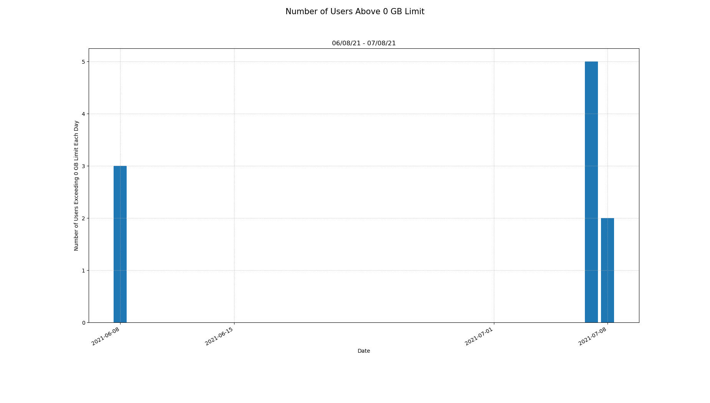
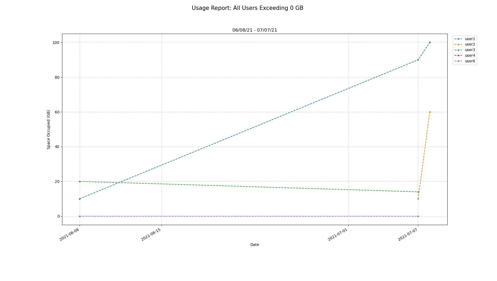
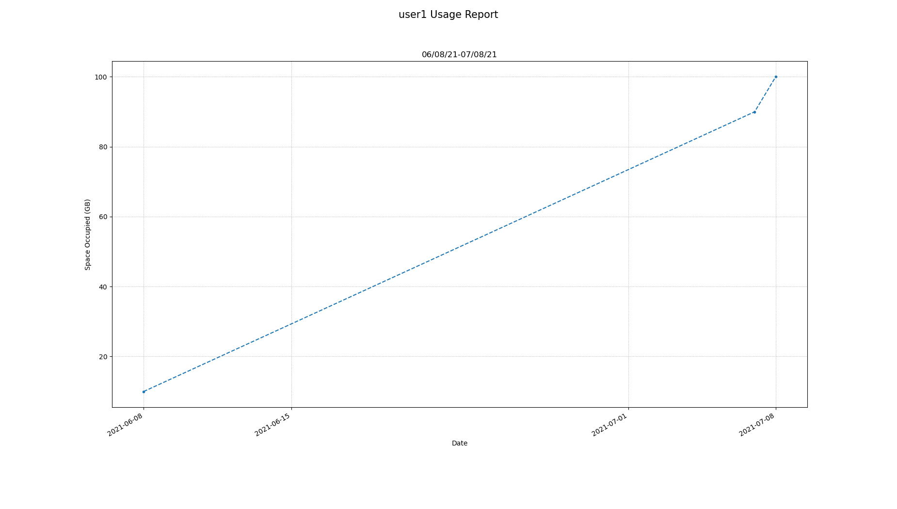

# Scratch Space Data Querying
a command line tool for specific data queries & visualization

## Table of Contents

- [About](#about)
- [Getting Started](#getting_started)
- [Usage](#usage)
- [Example Running Commands](#running)
- [Example Results](#results)


## 🧐 About <a name = "about"></a>
Given user id, dates, and corresponding space occupied, query and visualize the data. Assuming that data is given in the following format:
* **within a directory:**
    a list of documents with name "somePrefix_MMDDYY" (i.e. "b1000_scratch_073021") assuming that all dates are between 01/01/2000 and the current running date.
* **within each document:**
  ```bat
  user1 b1000 8
  user3 b1000 22
  user6 b1000 0
  ```
  in the format of "userID allocationNumber spaceOccupied"

## 🏁 Getting Started <a name = "getting_started"></a>

These instructions will get you a copy of the project up and running on your local machine for development and testing purposes.

```bat
conda install -c conda-forge matplotlib
conda install tqdm
```
or
```bat
conda env create --file env.yml
```

## 🎈 Usage <a name="usage"></a>

#### 1. ``` -h  ``` find all available options

#### 2. Usage Report Query 1: All users above certain GB of space occupied
* **Required**: 
  * ```--dir someDirectory ```
    * indicate where the data files are; otherwise, it will look for files within the current directory
  * ```--spaceThresh someInteger ```
    * specify a lower bound of number of GB
* **Optional:** 
  * ```--start MM/DD/YY and --end MM/DD/YY ```
    * specify a time range to query the data (please follow this date format, i.e. 08/31/21)
  * ```--out someString ```
    * specify a name of the output figures
  * ```--prefix someString ```
    * specify a common prefix of input data files

####3. Usage Report Query 2: All data of a given user
* **Required**: 
  * ```--dir someDirectory ```
    * indicate where the data files are; otherwise, it will look for files within the current directory
  * ```--uid someString```
    * specify the netID of a user you would like to query
* **Optional:** 
  * ```--start MM/DD/YY and --end MM/DD/YY ```
    * specify a time range to query the data (please follow this date format, i.e. 08/31/21)
  * ```--out someString```
    * specify a name of the output figure
  * ```--prefix someString ```
    * specify a common prefix of input data files

## 🚀 Example Running Commands <a name = "running"></a>

1. Create an interactive job session
```bat
srun --account=XXXXX --time=00:20:00 --partition=buyin --mem=64G  --pty bash -l
```

2. Active the conda environment
```bat
conda activate scratchVis
```

3. Run the script
* Query all users given the data under directory *<../../..>* exceeding *<10000>* GB of usage between *<05/01/21>* and *<07/01/21>*, and name the output figures starting as *<test1_**.png>*
  ```bat
  python visual.py --dir ../../artspace_reports/daily/scratch --spaceThresh 10000 --start 05/01/21 --end 07/01/21 --out test1
  ```

* Query all data of user with userID *<xx>* given the directory *<../../..>* between *<05/01/21>* and *<07/01/21>*, and name the output figure as *<test1.png>*
  ```bat
  python visual.py --dir ../../artspace_reports/daily/scratch --uid XX --start 05/01/21 --end 07/01/21 --out test1
  ```

## 🎆 Example Results <a name = "results"></a>
* **Expecting command line outputs similar to:**
start ploting frequency bars
Reading all files under data/ , starting with b1042_scratch
Querying all user id with 0 GB occupied and above
Total: 5 unique users
Begin from:  06/08/21 to 07/08/21 - 31 days
3 days collected
ranked: {'user1': 66.67, 'user2': 35.0, 'user3': 17.0, 'user4': 0.0, 'user6': 0.0}
start ploting multiple user IDs
100%|████████████████████████████████████████████████████████████████████████████| 5/5 [00:03<00:00,  1.38it/s]

* **Expecting local image output files similar to:**


